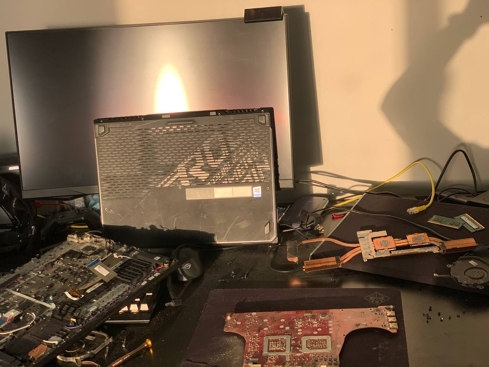
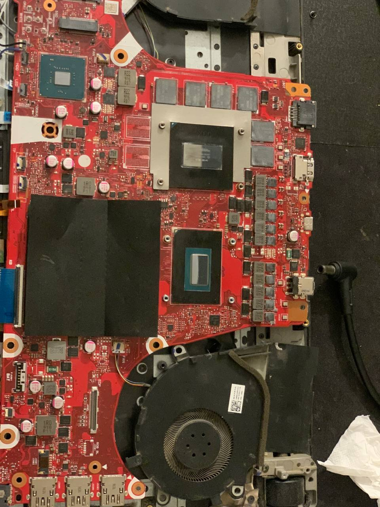

# Laptop-power-circuit-diagnosis
A normal day in my life ! Took apart my ASUS G731 to see why it wouldn’t turn on. Found a damaged power circuit.

# ASUS G731 - Power Circuit Issue

This is a simple log of a hardware issue I found in my ASUS ROG G731 laptop.

## What I did:
- Took the laptop apart completely
- Checked the motherboard
- Found visible damage in the main power circuit area

 ## Images

